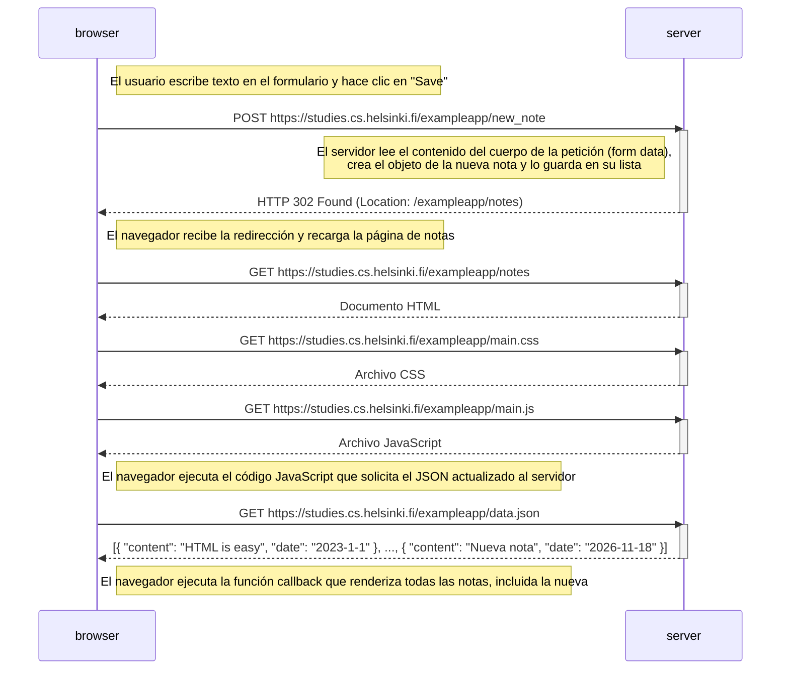

# Diagrama de nueva nota

```mermaid
sequenceDiagram
    participant browser
    participant server

    Note right of browser: El usuario escribe texto en el formulario y hace clic en "Save"

    browser->>server: POST https://studies.cs.helsinki.fi/exampleapp/new_note
    activate server
    Note left of server: El servidor lee el contenido del cuerpo de la petición (form data),<br/>crea el objeto de la nueva nota y lo guarda en su lista
    server-->>browser: HTTP 302 Found (Location: /exampleapp/notes)
    deactivate server

    Note right of browser: El navegador recibe la redirección y recarga la página de notas

    browser->>server: GET https://studies.cs.helsinki.fi/exampleapp/notes
    activate server
    server-->>browser: Documento HTML
    deactivate server

    browser->>server: GET https://studies.cs.helsinki.fi/exampleapp/main.css
    activate server
    server-->>browser: Archivo CSS
    deactivate server

    browser->>server: GET https://studies.cs.helsinki.fi/exampleapp/main.js
    activate server
    server-->>browser: Archivo JavaScript
    deactivate server

    Note right of browser: El navegador ejecuta el código JavaScript que solicita el JSON actualizado al servidor

    browser->>server: GET https://studies.cs.helsinki.fi/exampleapp/data.json
    activate server
    server-->>browser: [{ "content": "HTML is easy", "date": "2023-1-1" }, ..., { "content": "Nueva nota", "date": "2026-11-18" }]
    deactivate server

    Note right of browser: El navegador ejecuta la función callback que renderiza todas las notas, incluida la nueva
```
